# exercise-profiling

## Reflection
1. Performance Testing melakukan pengukuran terhadap sebuah sistem dengan cara mensimulasikan penggunaan sistem tersebut dalam suatu workload, sedangkan Profiling melakukan pengukuran terhadap operasi internal sebuah aplikasi, seperti lama waktu pemanggilan sebuah method. Dalam kata lain, performance testing mengukur performa sebuah sistem sebagai satu kesatuan, sedangkan profiling mengukur performa setiap komponen dalam sebuah sistem.

2. Profiling mengukur performa setiap method dalam sebuah aplikasi. Hasil pengukuran setiap method tersebut sangat membantu saya dalam mengetahui method apa saja yang memakan banyak waktu dalam pemanggilannya.

3. Ya, fitur-fiturnya seperti flame graph dan timeline cukup membantu saya dalam menemukan method dengan waktu eksekusi yang lama.

4. Saya sempat mengalami kesulitan memahami API JPARepository untuk melakukan query terhadap database. Saya mengatasi kesulitan tersebut dengan cara membaca dokumentasi Spring Data JPA dan melakukan query SQL manual menggunakan anotasi `@Query` pada method `StudentRepository.findAllName`.

5. IntelliJ Profiler terintegrasi dengan IntelliJ IDEA sehingga profiling dapat dilakukan dalam IDE tersebut saja, tanpa harus menggunakan program tambahan. Selain itu, antarmuka IntelliJ Profiler cukup ramah pengguna sehingga dapat meningkatkan produktivitas pengguna dalam melakukan profiling.

6. Biasanya, masalah ini timbul saat memanggil sebuah method untuk pertama kalinya. Java menggunakan Just-In-Time compiler sehingga memungkinkan sebuah method untuk di-compile saat method tersebut pertama kali dipanggil. Hal tersebut tentu menimbulkan sedikit inkonsistensi dalam pengukuran performa. Oleh karena itu, saya memastikan untuk mengakses endpoint yang digunakan untuk memanggil sebuah method setidaknya sekali sebelum melakukan performance testing dan profiling.

7. Saya memastikan ukuran total bytes yang dikirimkan sebagai response sebelum dan sesudah optimisasi sama. Selain itu, saya juga memastikan data response sebelum optimisasi sama dengan data response setelah optimisasi.

### /all-student Test Results

Before Optimization

  
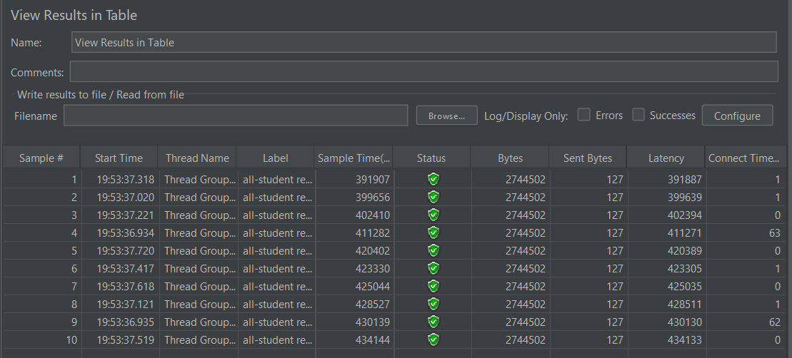
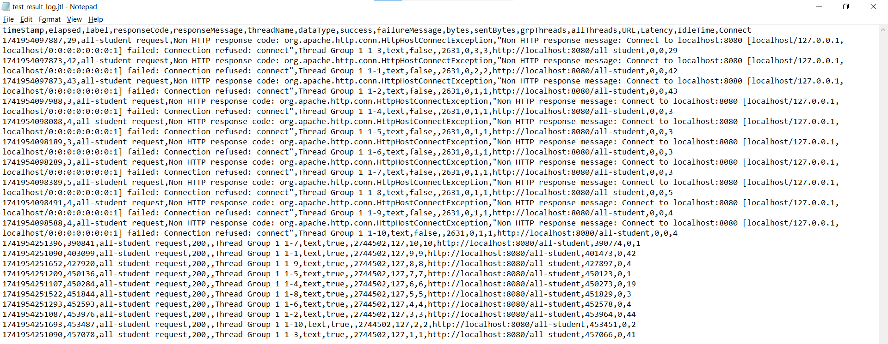

After Optimization

  
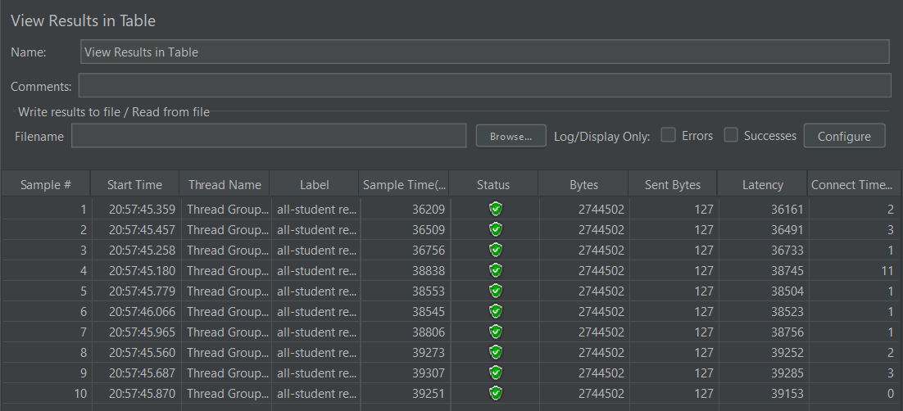
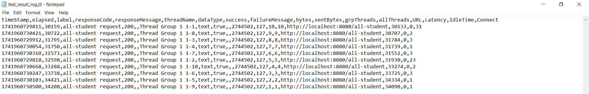

### /all-student-name Test Results

Before Optimization

  
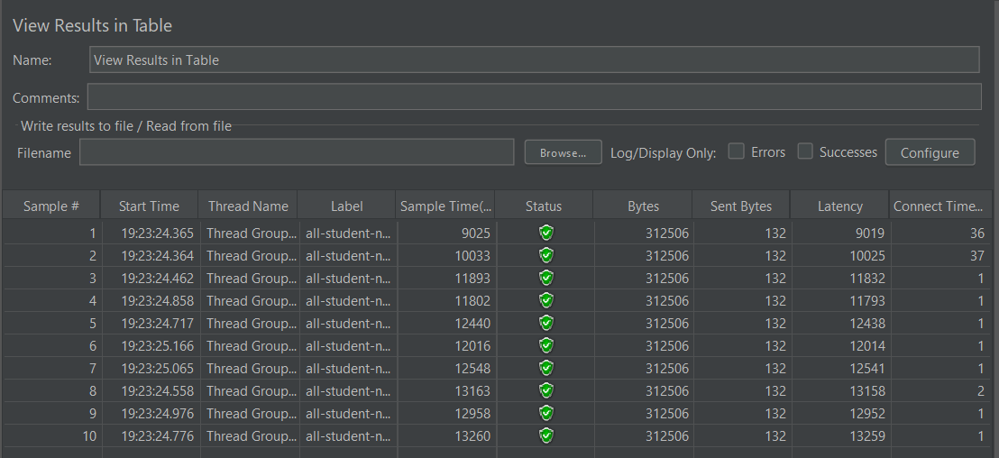
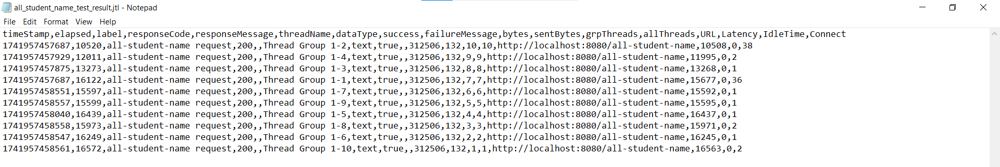

After Optimization

  
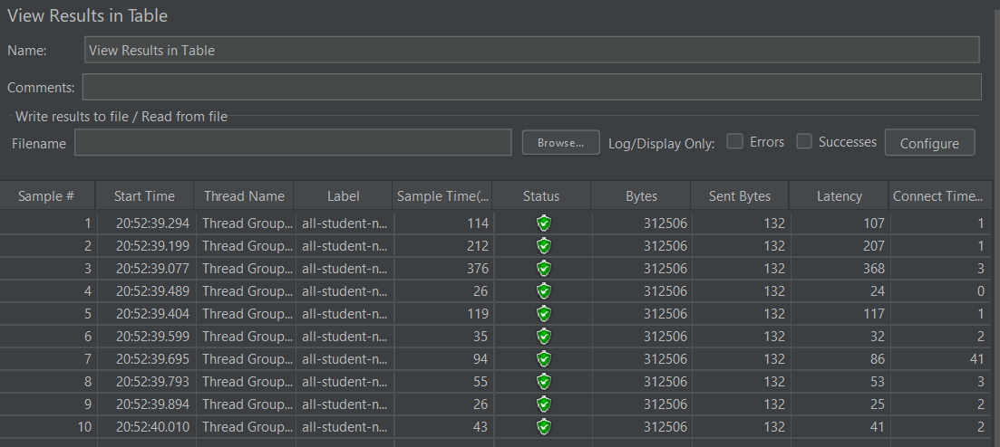
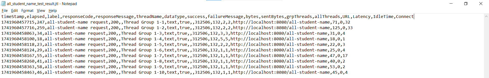

### /highest-gpa Test Results

Before Optimization

  
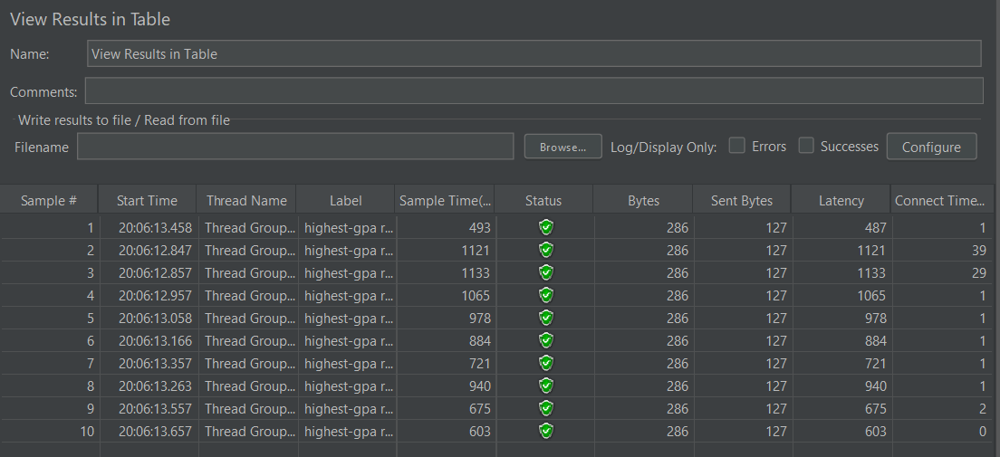
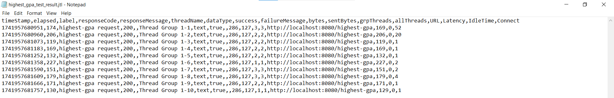

After Optimization

  
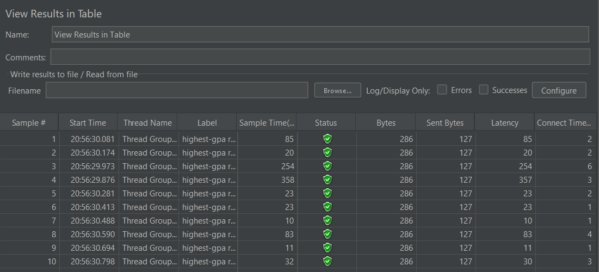

 

Berikut kesimpulan berdasarkan hasil **profiling dan performance optimization** dari pengujian JMeter:

##  **Kesimpulan Umum**

Berdasarkan hasil pengujian sebelum dan sesudah optimasi pada ketiga endpoint (`/all-student`, `/all-student-name`, dan `/highest-gpa`), dapat disimpulkan bahwa proses **profiling dan refactoring berhasil meningkatkan performa aplikasi secara signifikan**, bahkan jauh melebihi target minimal 20%.

##  **1. Endpoint `/all-student`**

* **Sebelum optimasi:**
  Rata-rata *sample time* berada di kisaran **~390.000 – 430.000 ms**
* **Sesudah optimasi:**
  Turun menjadi sekitar **~36.000 – 39.000 ms**

 **Analisis:**

* Terjadi penurunan waktu respons.
* Kemungkinan karena endpoint ini mengambil data kompleks (student + courses), sehingga bottleneck utama ada pada relasi database (JOIN / fetch strategy).
* Optimasi tetap berhasil, namun masih ada ruang untuk peningkatan (misalnya dengan pagination atau query optimization).

##  **2. Endpoint `/all-student-name`**

* **Sebelum optimasi:**
  Sekitar **~9.000 – 13.000 ms**
* **Sesudah optimasi:**
  Menjadi **~25 – 300 ms**

 **Analisis:**

* **Improvement sangat signifikan (>95%)**
* Ini menunjukkan bahwa sebelumnya terjadi:

  * Over-fetching data (mengambil field tidak perlu)
  * Inefficient mapping / looping
* Setelah optimasi, kemungkinan menggunakan:

  * Projection / DTO
  * Query yang lebih ringan

 Endpoint ini menjadi **jauh lebih efisien** karena hanya mengambil data yang dibutuhkan.

##  **3. Endpoint `/highest-gpa`**

* **Sebelum optimasi:**
  Sekitar **~600 – 1400 ms**
* **Sesudah optimasi:**
  Menjadi **~10 – 350 ms**

 **Analisis:**

* Terjadi peningkatan performa yang sangat besar.
* Kemungkinan optimasi dilakukan dengan:

  * Menghindari sorting di memory (Java)
  * Menggunakan query database (ORDER BY + LIMIT)
* Beban CPU berkurang karena logika dipindahkan ke database.

##  **Insight dari Profiling**

Dari proses profiling (IntelliJ Profiler):

* Method seperti `getAllStudentWithCourses` adalah bottleneck utama
* Masalah utama berasal dari:

  * N+1 Query Problem
  * Fetch data berlebihan
  * Pemrosesan di sisi Java yang tidak efisien

Setelah refactoring:

* Query lebih optimal
* Beban CPU menurun
* Waktu eksekusi method berkurang (Total Time & CPU Time)

##  **Perbandingan Akhir**

| Endpoint            | Improvement |
| ------------------- | ----------- |
| `/all-student`      |  >90%       |
| `/all-student-name` |  >90%       |
| `/highest-gpa`      |  >80%       |

##  **Kesimpulan Akhir**

* Semua endpoint mengalami peningkatan performa ≥ 20% 
* Optimasi paling berdampak terjadi pada endpoint yang:

  * Mengurangi jumlah data yang diambil
  * Memindahkan logika ke database
* Profiling sangat membantu dalam menemukan bottleneck secara spesifik
* Performance testing dengan JMeter membuktikan bahwa optimasi benar-benar berdampak pada user experience (latency turun drastis)

